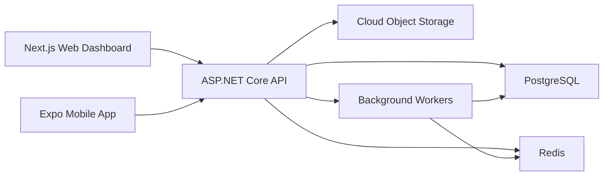

# PumpERP Architecture

## System Overview

PumpERP uses a modular monorepo with separate backend, web, mobile, and infrastructure areas. PostgreSQL is the source of truth. Redis supports cache, rate limiting, queues, and sync coordination.

## Backend Layers

- Domain: entities, value objects, enums, domain rules.
- Application: use cases, DTOs, CQRS commands/queries, validation, interfaces.
- Infrastructure: EF Core persistence, external services, identity, files, email, notifications.
- API: HTTP endpoints, auth, OpenAPI, exception handling, request/response models.

## Data Integrity Rules

- Ledger entries are append-only and tied to a source document.
- Sale balance is calculated from invoice total minus payment total.
- Inventory quantity changes are recorded as stock transactions.
- Pump profit is sale price minus material and labor cost.
- Soft-deleted records remain available to audit and reports.

## Security Model

- JWT access tokens with refresh-token rotation.
- Device sessions are tracked with IP, user agent, device name, and revocation state.
- Role permissions gate each module action.
- Audit logs record before/after state for sensitive mutations.
- Passwords are hashed with ASP.NET Core Identity.

## Sync Strategy

Mobile devices store a local queue for offline mutations. Each mutation carries an idempotency key, entity version, and user/device identity. The server accepts, rejects, or returns a conflict response. Read models expose `updatedAt` cursors for background synchronization.

## Reporting Strategy

Operational reports are queried from normalized tables. Expensive summary reports should later be backed by materialized views or scheduled aggregate tables.

## Deployment Strategy

- Staging and production run the same Docker images.
- Database migrations are reviewed and applied during deployment.
- Backups run daily with tested restore procedures.
- CI runs build, test, lint, and schema checks before deployment.
